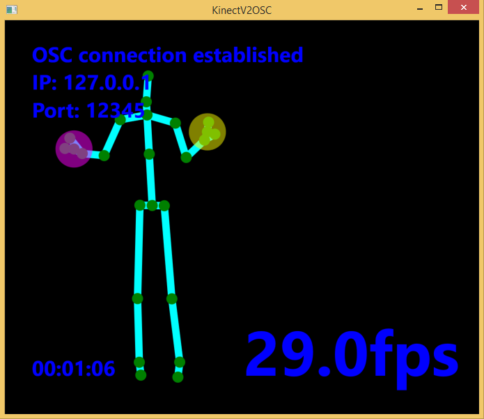
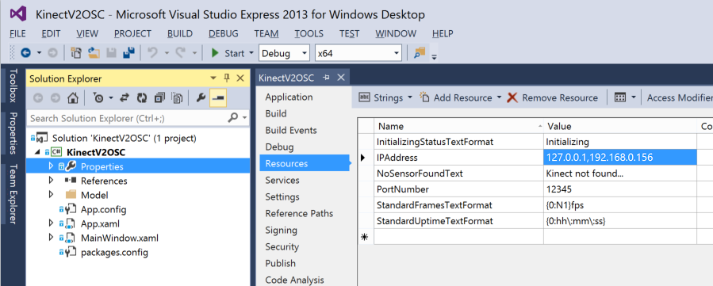

KinectV2OSC
===========
Broadcasts [KinectV2](http://www.microsoft.com/en-us/kinectforwindows/purchase/) skeletal data over OSC. That's it.


Handy if you want to quickly get skeleton data off of Windows and onto Mac, or into some other Windows app.

Just run the app
----------------
If you just want to run the app without digging into the code, you can simply follow these instructions:
- Note that you need Windows 8.1, a USB3 port, and a new V2 Kinect sensor
- Download and install the [Kinect for Windows SDK 2.0](http://www.microsoft.com/en-us/kinectforwindows/develop/default.aspx)
- Download the release executable and run it. You should see a screen like this:



- By default, the executable broadcasts to port `12345` on IP address `127.0.0.1`
- To broadcast elsewhere, create a file named `ip.txt` in the same folder as the executable. Give the file a comma-separated list of IP asddresses to broadcast to, i.e.

```sh
127.0.0.1,192.168.1.100,192.168.1.112
```

- Re-launch the executable

## OSC message structure
```
ADDRESS(/bodies/72057594037931587/kinectID) INT32(1)
ADDRESS(/bodies/72057594037931587/jointRoot) FLOAT(0.096339285) FLOAT(-0.26055318) FLOAT(0.7828601)
ADDRESS(/bodies/72057594037931587/joints/SpineBase) STRING(Tracked)
ADDRESS(/bodies/72057594037931587/joints/SpineMid) STRING(Tracked)
ADDRESS(/bodies/72057594037931587/joints/Neck) STRING(Tracked)
ADDRESS(/bodies/72057594037931587/joints/Head) STRING(Inferred)
ADDRESS(/bodies/72057594037931587/joints/ShoulderLeft) STRING(Inferred)
ADDRESS(/bodies/72057594037931587/joints/ElbowLeft) STRING(Inferred)
ADDRESS(/bodies/72057594037931587/joints/WristLeft) STRING(Tracked)
ADDRESS(/bodies/72057594037931587/joints/HandLeft) STRING(Tracked)
ADDRESS(/bodies/72057594037931587/joints/ShoulderRight) STRING(Inferred)
ADDRESS(/bodies/72057594037931587/joints/ElbowRight) STRING(Tracked)
ADDRESS(/bodies/72057594037931587/joints/WristRight) STRING(Tracked)
ADDRESS(/bodies/72057594037931587/joints/HandRight) STRING(Tracked)
ADDRESS(/bodies/72057594037931587/joints/HipLeft) STRING(Tracked)
ADDRESS(/bodies/72057594037931587/joints/KneeLeft) STRING(Inferred)
ADDRESS(/bodies/72057594037931587/joints/AnkleLeft) STRING(Inferred)
ADDRESS(/bodies/72057594037931587/joints/FootLeft) STRING(Inferred)
ADDRESS(/bodies/72057594037931587/joints/HipRight) STRING(Tracked)
ADDRESS(/bodies/72057594037931587/joints/KneeRight) STRING(Inferred)
ADDRESS(/bodies/72057594037931587/joints/AnkleRight) STRING(Inferred)
ADDRESS(/bodies/72057594037931587/joints/FootRight) STRING(Inferred)
ADDRESS(/bodies/72057594037931587/joints/SpineShoulder) STRING(Tracked)
ADDRESS(/bodies/72057594037931587/joints/HandTipLeft) STRING(Tracked)
ADDRESS(/bodies/72057594037931587/joints/ThumbLeft) STRING(Tracked)
ADDRESS(/bodies/72057594037931587/joints/HandTipRight) STRING(Tracked)
ADDRESS(/bodies/72057594037931587/joints/ThumbRight) STRING(Tracked)
ADDRESS(/bodies/72057594037931587/joints/SpineBase) FLOAT(0.054474827) FLOAT(0.98063886) FLOAT(-0.13562874)
ADDRESS(/bodies/72057594037931587/joints/SpineMid) FLOAT(0.0409605) FLOAT(0.98868084) FLOAT(-0.14030287)
ADDRESS(/bodies/72057594037931587/joints/Neck) FLOAT(0.009490055) FLOAT(0.9750153) FLOAT(-0.2144577)
ADDRESS(/bodies/72057594037931587/joints/Head) FLOAT(0) FLOAT(0) FLOAT(0)
ADDRESS(/bodies/72057594037931587/joints/ShoulderLeft) FLOAT(-0.6512623) FLOAT(0.7344607) FLOAT(-0.17742231)
ADDRESS(/bodies/72057594037931587/joints/ElbowLeft) FLOAT(0.32910913) FLOAT(0.80717176) FLOAT(-0.4215699)
ADDRESS(/bodies/72057594037931587/joints/WristLeft) FLOAT(0.73773986) FLOAT(-0.5995474) FLOAT(0.21887179)
ADDRESS(/bodies/72057594037931587/joints/HandLeft) FLOAT(0.8014391) FLOAT(-0.27424702) FLOAT(0.53144795)
ADDRESS(/bodies/72057594037931587/joints/ShoulderRight) FLOAT(0.7814943) FLOAT(0.5962339) FLOAT(-0.06734554)
ADDRESS(/bodies/72057594037931587/joints/ElbowRight) FLOAT(0.82075524) FLOAT(0.28695175) FLOAT(0.26759043)
ADDRESS(/bodies/72057594037931587/joints/WristRight) FLOAT(-0.52879626) FLOAT(0.6705538) FLOAT(-0.2875889)
ADDRESS(/bodies/72057594037931587/joints/HandRight) FLOAT(-0.21843551) FLOAT(0.7547419) FLOAT(-0.23033035)
ADDRESS(/bodies/72057594037931587/joints/HipLeft) FLOAT(-0.60948867) FLOAT(0.78020775) FLOAT(-0.10111059)
ADDRESS(/bodies/72057594037931587/joints/KneeLeft) FLOAT(-0.5303592) FLOAT(-0.21773554) FLOAT(0.67299104)
ADDRESS(/bodies/72057594037931587/joints/AnkleLeft) FLOAT(0.75573444) FLOAT(0.009431983) FLOAT(-0.41459757)
ADDRESS(/bodies/72057594037931587/joints/FootLeft) FLOAT(0) FLOAT(0) FLOAT(0)
ADDRESS(/bodies/72057594037931587/joints/HipRight) FLOAT(0.67891246) FLOAT(0.68032664) FLOAT(-0.25716716)
ADDRESS(/bodies/72057594037931587/joints/KneeRight) FLOAT(0.10013193) FLOAT(0.76502025) FLOAT(-0.20600604)
ADDRESS(/bodies/72057594037931587/joints/AnkleRight) FLOAT(0.21053882) FLOAT(0.71658266) FLOAT(0.093767956)
ADDRESS(/bodies/72057594037931587/joints/FootRight) FLOAT(0) FLOAT(0) FLOAT(0)
ADDRESS(/bodies/72057594037931587/joints/SpineShoulder) FLOAT(0.018495465) FLOAT(0.98197436) FLOAT(-0.17818663)
ADDRESS(/bodies/72057594037931587/joints/HandTipLeft) FLOAT(0) FLOAT(0) FLOAT(0)
ADDRESS(/bodies/72057594037931587/joints/ThumbLeft) FLOAT(0) FLOAT(0) FLOAT(0)
ADDRESS(/bodies/72057594037931587/joints/HandTipRight) FLOAT(0) FLOAT(0) FLOAT(0)
ADDRESS(/bodies/72057594037931587/joints/ThumbRight) FLOAT(0) FLOAT(0) FLOAT(0)
ADDRESS(/bodies/72057594037931587/hands/Left) STRING(NotTracked) STRING(High)
ADDRESS(/bodies/72057594037931587/hands/Right) STRING(NotTracked) STRING(High)
```

Compile from source
-------------------
If you want to be able to change the port number, or edit the code, you will need to compile from source. Follow these instructions:
- Note that you need Windows 8.1, a USB3 port, and a new V2 Kinect sensor
- Download and install the [Kinect for Windows SDK 2.0](http://www.microsoft.com/en-us/kinectforwindows/develop/default.aspx)
- Install Visual Studio (I am using [Visual Studio Express 2013 for Windows Desktop](http://www.visualstudio.com/en-us/products/visual-studio-express-vs.aspx) - scroll down to find the download link)
- MAKE SURE you are using Visual Studio Express for **Windows Desktop** - you have to scroll down to find that link!!
- Clone this repo, and open KinectV2OSC.sln in Visual Studio. Hit the green 'Start' button. You should see a screen like this:


- To send to another destination, change the IP and port number here, and then re-launch:



You can enter a single IP Address or multiple, separated by commas.

What OSC messages get sent?
---------------------------
OSC messages are sent every frame. For each detected body, you will get a set of joints:

```sh
Address: /bodies/{bodyId}/joints/{jointId}
Values: - float:  positionX
        - float:  positionY
        - float:  positionZ
        - string: trackingState (Tracked, NotTracked or Inferred)
```

...and a pair of hands:

```sh
Address: /bodies/{bodyId}/hands/{handId} (Left or Right)
Values: - string: handState (Open, Closed, NotTracked, Unknown)
        - string: handConfidence (High, Low)
```

Project dependencies
--------------------
- [Rug OSC](https://www.nuget.org/packages/Rug.Osc/) to format and send messages
